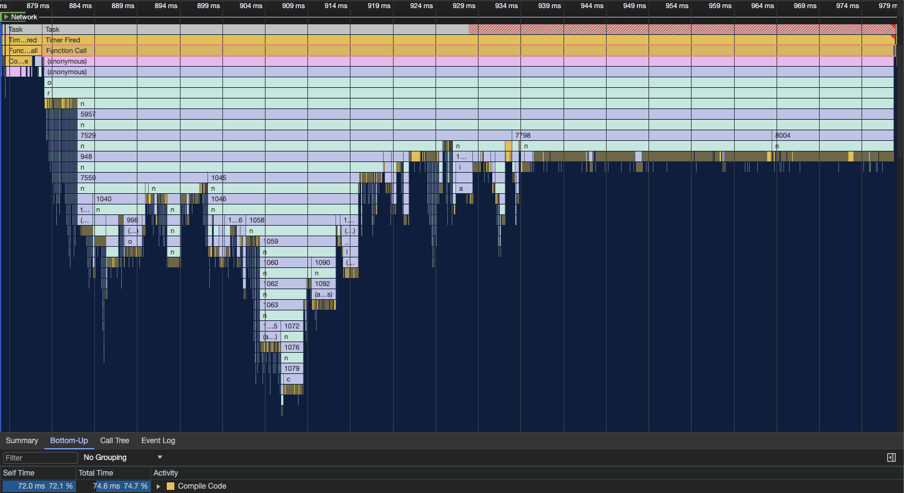
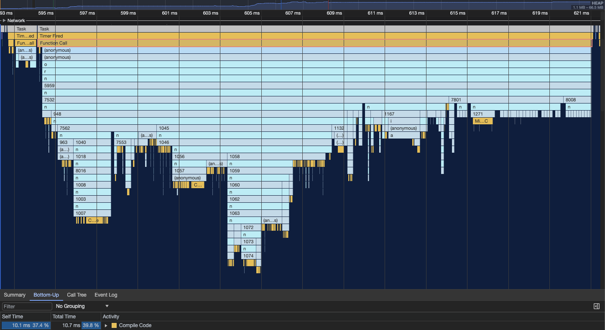

optimize-js-code-cache [](http://standardjs.com/)
========

Optimize a JavaScript file for faster execution, by wrapping almost all function expressions in parentheses. This allows
V8 to compile code in background thread and use the code cache. Forked from https://github.com/nolanlawson/optimize-js.

[A blog post](https://v8.dev/blog/preparser#pife) from the V8 team with some details.

Install
---

    npm install -g optimize-js-code-cache

Usage
---

    optimize-js-code-cache input.js > output.js

Example input:

```js
!function (){}();
function runIt(fun){ fun() }
runIt(function (){});
var x=function(){}();
var do1=function(){},do2=()=>{},dont1=function dont1(){};
[].concat([function(a){},b=>{},(function(c){}),(d=>{})]);
chunk.push([{1:function(a){},2:b=>{},x:function(a){},y:b=>{}}]);
```

Example output:

```js
!(function (){})();
function runIt(fun){ fun() }
runIt((function (){}));
var x=(function(){})();
var do1=(function(){}),do2=(()=>{}),dont1=function dont1(){};
[].concat([(function(a){}),(b=>{}),(function(c){}),(d=>{})]);
chunk.push([{1:(function(a){}),2:(b=>{}),x:(function(a){}),y:(b=>{})}]);
```

Benchmark overview
----

Bundle execution before:

- ≈74 ms code compilation
- ≈100 ms overall



Bundle execution after:

- ≈11 ms code compilation
- ≈27 ms overall



CLI
----

```
Usage: optimize-js-code-cache [ options ]

Options:
      --version                             Show version number        [boolean]
      --source-map, --sourceMap             Include source map         [boolean]
      --ecma-version, --ecmaVersion         The ECMAScript version to parse.
                                            Must be either 3, 5, 6 (or 2015), 7
                                            (2016), 8 (2017), 9 (2018), 10
                                            (2019), 11 (2020), 12 (2021), 13
                                            (2022), 14 (2023), or "latest" (the
                                            latest version the library
                                            supports). This influences support
                                            for strict mode, the set of reserved
                                            words, and support for new syntax
                                            features.
     [choices: 3, 5, 6, 7, 8, 9, 10, 11, 12, 13, 14, 15, 2015, 2016, 2017, 2018,
                                   2019, 2020, 2021, 2022, 2023, 2024, "latest"]
      --handle-function-declarations,       Specify how to handle
      --handleFunctionDeclarations          FunctionDeclaration nodes: "none"
                                            skips them completely; "unsafe"
                                            wraps all declarations; "safe" wraps
                                            only declarations that are not used
                                            before declaration and thus
                                            preserves hoisting (that otherwise
                                            can result in broken code, when the
                                            function is called before being
                                            assigned to variable).
                                             [choices: "none", "safe", "unsafe"]
  -h, --help                                Show help                  [boolean]

Examples:
  optimize-js-code-cache input.js > output.js    optimize input.js
  optimize-js-code-cache < input.js > output.js  read from stdin, write to stdout
```

JavaScript API
----

```js
const { optimizeJs } = require('optimize-js-code-cache');
const input = "!function() {console.log('wrap me!')}";
const output = optimizeJs(input); // "!(function() {console.log('wrap me!')})()"
```

You can also pass in arguments:

```js
const { optimizeJs } = require('optimize-js-code-cache');
const input = "!function() {console.log('wrap me!')}";
const output = optimizeJs(input, {
  sourceMap: true,
  ecmaVersion: 2024
}); // now the input is parsed as ES2024 and the output has source maps
```

FAQs
----

### How does it work?

The current implementation is to parse to a syntax tree and check for functions that:

1. Are immediately-invoked via any kind of call statement (`function(){}()`, `!function(){}()`, etc.)
2. Are passed in directly as arguments to another function
3. Are just plain function expressions or function declarations

The first method is an easy win – those functions are immediately executed. The second method is more of a heuristic, but tends
to be a safe bet given common patterns like Node-style errbacks, Promise chains, and UMD/Browserify/Webpack module declarations.
The third method supposes that most function expressions will be compiled and executed during the execution of code bundle.

In all such cases, `optimize-js-code-cache` wraps the function in parentheses.

### But... you're adding bytes!

Yes, `optimize-js-code-cache` might add as many as two bytes (horror!) per function expression and up to seven bytes per
function declaration, which amounts to practically nil once you take gzip into account.

### Is `optimize-js-code-cache` intended for library authors?

If you are already shipping a bundled, minified version of your library, then there's no reason not to apply `optimize-js-code-cache`
(assuming you benchmark your code to ensure it does indeed help!). However, note that `optimize-js-code-cache` should run
_after_ Terser/Uglify/any other minification, since they strip extra parentheses and also [negate IIFEs by default](https://github.com/mishoo/UglifyJS2/issues/640).
This also means that if your users apply Uglification to your bundle, then the optimization will be undone.

Also note that because `optimize-js-code-cache` optimizes for some patterns that are based on heuristics rather than _known_
eagerly-invoked functions, it may actually hurt your performance in some cases. (See benchmarks below for examples.)
Be sure to check that `optimize-js-code-cache` is a help rather than a hindrance for your particular codebase, using something like:

```html
<script>
var start = performance.now();
</script>
<script src="myscript.js"></script>
<script>
var end = performance.now();
console.log('took ' + (end - start) + 'ms');
</script>
```

Note that the script boundaries are actually recommended, in order to truly measure the full parse/compile time.
If you'd like to avoid measuring the network overhead, you can see how we do it in [our benchmarks](https://github.com/nolanlawson/optimize-js/blob/bbac7678656c85a1e4b98cf22ea4d5342965b2fd/benchmarks/index.html#L111-L126).

You may also want to check out [marky](http://github.com/nolanlawson/marky),
which allows you to easily set mark/measure points that you can visually inspect in the Dev Tools timeline to ensure that the full
compile time is being measured.

### Shouldn't this be Uglify's job?

Possibly! This is a free and open-source library, so I encourage anybody to borrow the code or the good ideas. :)

### Does this really work for every JavaScript engine?

Based on tests, this optimization seems to work best for V8 (Chrome), followed by SpiderMonkey (Firefox). For JavaScriptCore
(Safari) it seems to be basically a wash, and may actually be a slight regression overall depending on your codebase. (Again,
this is why it's important to actually measure on your own codebase, on the browsers you actually target!)

See also
---

* [Grunt plugin for optimize-js](https://github.com/sergejmueller/grunt-optimize-js)
* [Gulp plugin for optimize-js](https://github.com/prateekbh/gulp-optimize-js)
* [Webpack plugin for optimize-js](https://github.com/vigneshshanmugam/optimize-js-plugin)
* [broccoli-ember-preparse](https://www.npmjs.com/package/broccoli-ember-preparse)
* [to-fast-properties](https://github.com/sindresorhus/to-fast-properties)
* [V8LazyParsePlugin](https://github.com/TheLarkInn/V8LazyParseWebpackPlugin)

Contributing
-----

Build and run tests:

```bash
npm install
npm test
```

Run the benchmarks:

```bash
npm run benchmark # then open localhost:9090 in a browser
```

Test code coverage:

```bash
npm run coverage
```
